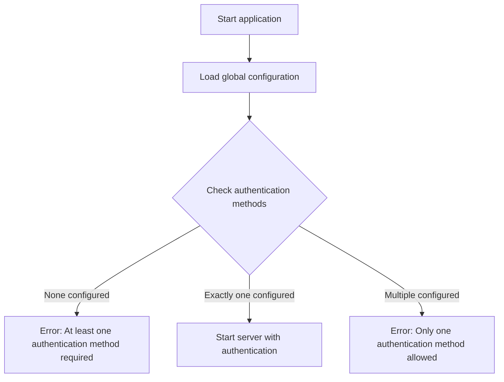
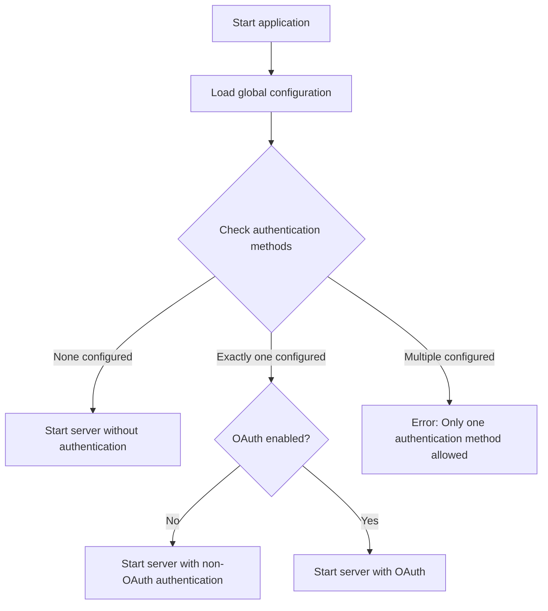
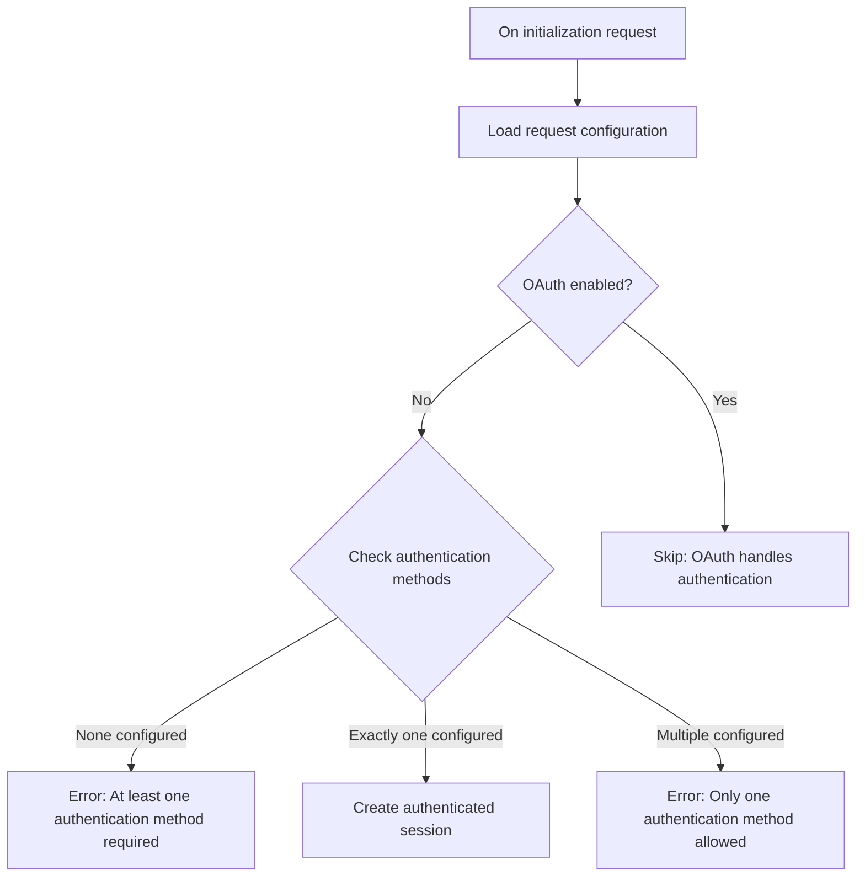

Before the DocSpace MCP server, the DocSpace authorization server had limitations that prevented MCP clients from using the OAuth flow due to how it handles dynamic client registration and scope handling.

## Dynamic Client Registration

The DocSpace authorization server does not support OAuth dynamic client registration, which the MCP authorization specification relies on. Without this support, MCP clients cannot register themselves directly with the DocSpace authorization server.

The MCP server addresses this limitation by operating in one of two modes:

1. When configured with pre-defined OAuth credentials, the MCP server exposes a
   registration endpoint that returns these credentials to all MCP clients. All
   MCP clients effectively share the same OAuth application;
2. When configured without pre-defined OAuth credentials, the MCP server expects
   users to provide their own OAuth client credentials through the MCP client
   interface.

The first mode is optional. The second mode is always available when the OAuth
is enabled.

## Scope Handling

The MCP server modifies the OAuth flow to address scope-related compatibility
issues between MCP clients and the DocSpace authorization server:

1. Some MCP clients request scopes that the DocSpace authorization server does
   not recognize, causing the authorization server to reject the request. The
   MCP server ignores all scope parameters from incoming requests and omits them
   when forwarding to the authorization server. The DocSpace authorization
   server interprets requests without scope parameters as requesting all scopes
   granted to the application;
2. Some MCP clients validate scope values in token responses. When the DocSpace
   authorization server returns all scopes granted to the application, these
   clients may fail or display errors if the returned scopes differ from those
   they requested. The MCP server removes scope values from token responses
   before returning them to MCP clients.

Users effectively operate with all permissions granted to the OAuth application,
regardless of which scopes the MCP client originally requested.

## How the MCP server addresses the Doc authorization limitations 

The MCP server acts as an OAuth proxy to address these limitations by using the DocSpace API to create an oAuth application and then using the client details to authenticate the mcp server-client connection. 

To create a DocSpace oAuth application, follow the steps in the [DocSpace
OAuth application creation guide][DocSpace API: Creating OAuth Application].
When configuring the application, ensure the following settings are properly
configured:

- **Redirect URIs**: Set to the MCP server's callback endpoint. For the public
  instance, use https://mcp.onlyoffice.com/oauth/callback. For self-hosted
  instances, replace the base URL with your MCP server's URL;
- **Allowed Origins**: Set to the MCP server's base URL. For the public
  instance, use https://mcp.onlyoffice.com. For self-hosted instances, use your
  MCP server's URL;
- **PKCE**: Enable PKCE (Proof Key for Code Exchange) for the application.

After creating the application, note the **Client ID** and **Client Secret**
values. Use these credentials to configure the MCP server or [provide them
through the MCP client interface.](clients.md)

## Other authentication methods

Asides from authenticating with OAuth, the DocSpace MCP server also allows you to authenticate with:

- API Key (Header)
- Personal Access Token (PAT)
- API key in Authorization header

## Resolving authentication

The authentication resolution process depends on the transport type used and the authentication methods configured. The following flowcharts illustrate how
authentication is resolved for different scenarios.

### Global Configuration

During application startup, the DocSpace MCP server validates the configured authentication methods based on the selected transport protocol.

#### stdio Transport

For stdio transport, exactly one authentication method must be configured.

#### HTTP-like Transport

HTTP-like transports support optional authentication, allowing servers to run with or without authentication depending on the use case.

### Request Configuration

For HTTP-like transports, authentication can be configured on the request level
using query parameters and custom headers, unless OAuth is being used.

