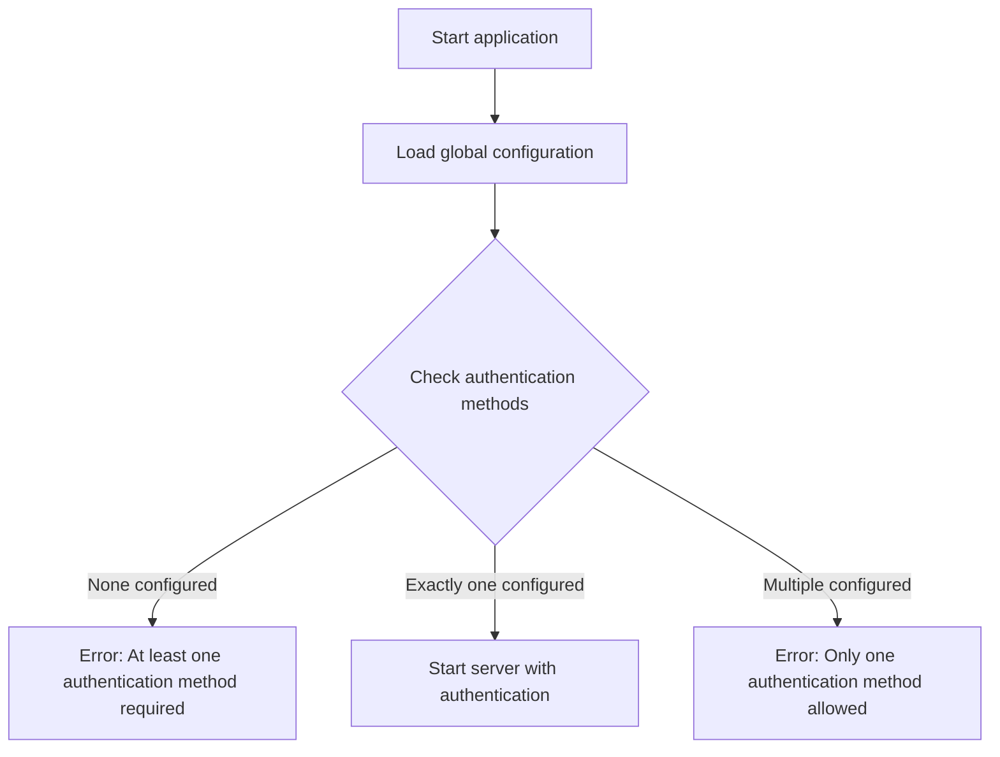
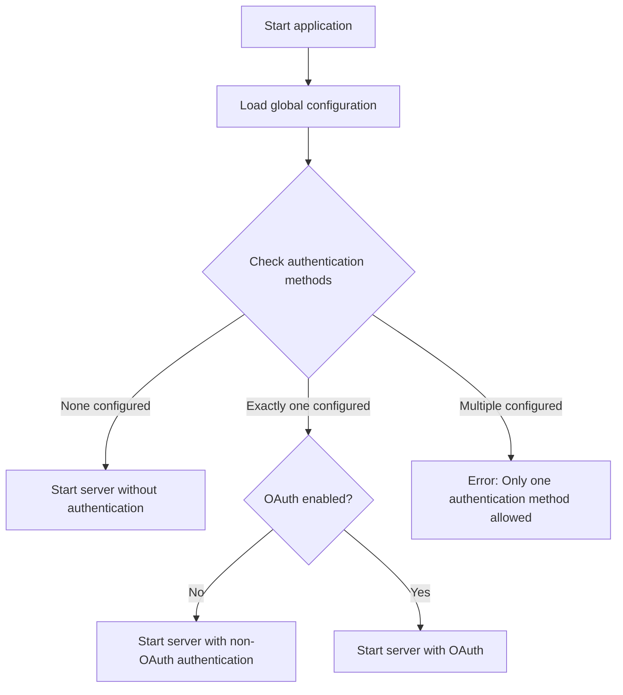
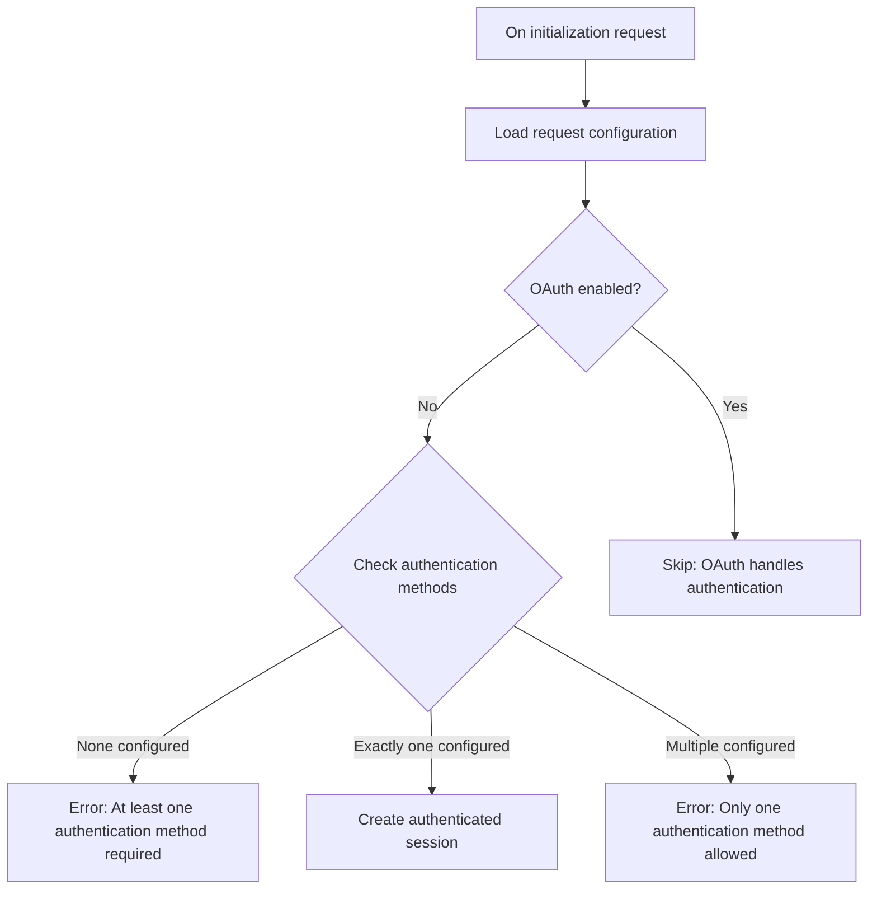

# Authentication Resolution

This document describes how the DocSpace MCP server resolves authentication
methods based on transport configuration and available authentication options.

## Contents

- [Visualization](#visualization)
  - [Global Configuration](#global-configuration)
    - [stdio Transport](#stdio-transport)
    - [HTTP-like Transport](#http-like-transport)
  - [Request Configuration](#request-configuration)
- [References](#references)

## Visualization

The authentication resolution process depends on the transport type used and the
authentication methods configured. The following flowcharts illustrate how
authentication is resolved for different scenarios.

### Global Configuration

During application startup, the DocSpace MCP server validates the configured
authentication methods based on the selected transport protocol.

#### stdio Transport

For stdio transport, exactly one authentication method must be configured.

#### HTTP-like Transport

HTTP-like transports support optional authentication, allowing servers to run
with or without authentication depending on the use case.

### Request Configuration

For HTTP-like transports, authentication can be configured on the request level
using query parameters and custom headers, unless OAuth is being used.

## References

- [DocSpace MCP: Global Configuration]
- [DocSpace MCP: Request Configuration]

<!-- Definitions -->

[DocSpace MCP: Global Configuration]: ./global-configuration.md
[DocSpace MCP: Request Configuration]: ./request-configuration.md
