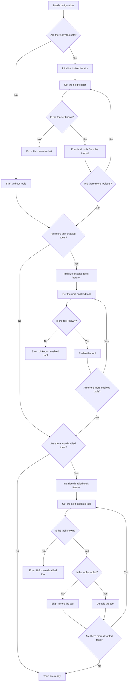

# Tools Resolution

This document describes how the DocSpace MCP server resolves which tools are
available based on toolset configuration and enabled/disabled tool options.

## Contents

- [Visualization](#visualization)
  - [Global Configuration](#global-configuration)
  - [Request Configuration](#request-configuration)
- [Examples](#examples)
  - [Enable a Tool From Not Specified Toolset](#enable-a-tool-from-not-specified-toolset)
  - [Disable a Tool From Specified Toolset](#disable-a-tool-from-specified-toolset)
  - [Manually Specify Tools to Be Available](#manually-specify-tools-to-be-available)
- [References](#references)

## Visualization

The tools resolution process follows a sequence that starts with toolsets, adds
explicitly enabled tools, and removes explicitly disabled tools. The flowcharts
below illustrate this process for both global and request-level configuration.

### Global Configuration

During server initialization, the global configuration determines the baseline
set of available tools.

### Request Configuration

For HTTP-like transports, request-specific headers can override the global tool
configuration using the same resolution process. However, the available toolsets
and tools are constrained by what was configured globally.

## Examples

For simplicity, let us come up with a small list of available toolsets and
tools. The real DocSpace MCP server provides more of them, but for these
examples, just a few are enough:

| Toolset   | Tools                                          |
| --------- | ---------------------------------------------- |
| `files`   | `create_file`, `get_file`, `delete_file`       |
| `folders` | `create_folder`, `get_folder`, `delete_folder` |

### Enable a Tool From Not Specified Toolset

Configuration:

| Key           | Value           |
| ------------- | --------------- |
| Toolsets      | `files`         |
| Enabled Tools | `create_folder` |

Result:

| Toolset   | Tools                                    |
| --------- | ---------------------------------------- |
| `files`   | `create_file`, `get_file`, `delete_file` |
| `folders` | `create_folder`                          |

### Disable a Tool From Specified Toolset

Configuration:

| Key            | Value           |
| -------------- | --------------- |
| Toolsets       | `files`         |
| Enabled Tools  | `create_folder` |
| Disabled Tools | `get_file`      |

Result:

| Toolset   | Tools                        |
| --------- | ---------------------------- |
| `files`   | `create_file`, `delete_file` |
| `folders` | `create_folder`              |

### Manually Specify Tools to Be Available

Configuration:

| Key            | Value                                      |
| -------------- | ------------------------------------------ |
| Toolsets       | (empty, to disable all tools)              |
| Enabled Tools  | `create_file`, `get_file`, `create_folder` |
| Disabled Tools | `get_file`, `delete_folder`                |

Result:

| Toolset   | Tools           |
| --------- | --------------- |
| `files`   | `create_file`   |
| `folders` | `create_folder` |

## References

- [DocSpace MCP: Global Configuration]
- [DocSpace MCP: Request Configuration]

<!-- Definitions -->

[DocSpace MCP: Global Configuration]: ./global-configuration.md
[DocSpace MCP: Request Configuration]: ./request-configuration.md
