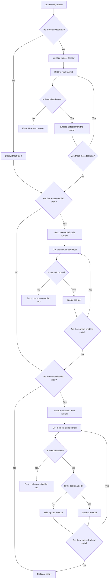

This document describes how the DocSpace MCP server implements the Tools concept from the MCP specification and the following:

- [Toolsets](#toolsets)
- [Regular tools](#regular-tools)
- [Meta tools](#meta-tools)
- [Resolving tools](#resolving-tools)
- [Examples of tools in action](#examples)

## Toolsets

A toolset is a DocSpace MCP server extension to the standard MCP Tools concept.
Toolsets provide logical grouping of related tools to organize
DocSpace functionality into manageable categories.

<!--generate toolsets-start-->

| #   | Toolset Name | Toolset Description                  |
| --- | ------------ | ------------------------------------ |
| 1   | `files`      | Operations for working with files.   |
| 2   | `folders`    | Operations for working with folders. |
| 3   | `people`     | Operations for working with users.   |
| 4   | `rooms`      | Operations for working with rooms.   |

<!--generate toolsets-end-->

## Regular Tools

Regular tools are standard MCP Tools. Each tool corresponds to a specific
DocSpace operation.

<!--generate tools-start-->

<table>
<thead>
<tr><th>#</th><th>Tool Name</th><th>Tool Description</th></tr>
</thead>
<tbody>
<tr><td></td><th scope="rowgroup">Files Toolset</th><td></td></tr>
<tr><td>1</td><td><code>copy_batch_items</code></td><td>Copy to a folder.</td></tr>
<tr><td>2</td><td><code>delete_file</code></td><td>Delete a file.</td></tr>
<tr><td>3</td><td><code>download_file_as_text</code></td><td>Download a file as text.</td></tr>
<tr><td>4</td><td><code>get_file_info</code></td><td>Get file information.</td></tr>
<tr><td>5</td><td><code>move_batch_items</code></td><td>Move to a folder.</td></tr>
<tr><td>6</td><td><code>update_file</code></td><td>Update a file.</td></tr>
<tr><td>7</td><td><code>upload_file</code></td><td>Upload a file.</td></tr>
</tbody>
<tbody>
<tr><td></td><th scope="rowgroup">Folders Toolset</th><td></td></tr>
<tr><td>8</td><td><code>create_folder</code></td><td>Create a folder.</td></tr>
<tr><td>9</td><td><code>delete_folder</code></td><td>Delete a folder.</td></tr>
<tr><td>10</td><td><code>get_folder_content</code></td><td>Get content of a folder.</td></tr>
<tr><td>11</td><td><code>get_folder_info</code></td><td>Get folder information.</td></tr>
<tr><td>12</td><td><code>get_my_folder</code></td><td>Get the 'My Documents' folder.</td></tr>
<tr><td>13</td><td><code>rename_folder</code></td><td>Rename a folder.</td></tr>
</tbody>
<tbody>
<tr><td></td><th scope="rowgroup">People Toolset</th><td></td></tr>
<tr><td>14</td><td><code>get_all_people</code></td><td>Get all people.</td></tr>
</tbody>
<tbody>
<tr><td></td><th scope="rowgroup">Rooms Toolset</th><td></td></tr>
<tr><td>15</td><td><code>archive_room</code></td><td>Archive a room.</td></tr>
<tr><td>16</td><td><code>create_room</code></td><td>Create a room.</td></tr>
<tr><td>17</td><td><code>get_room_access_levels</code></td><td>Get a list of available room invitation access levels.</td></tr>
<tr><td>18</td><td><code>get_room_info</code></td><td>Get room information.</td></tr>
<tr><td>19</td><td><code>get_room_security_info</code></td><td>Get a list of users with their access levels to a room.</td></tr>
<tr><td>20</td><td><code>get_room_types</code></td><td>Get a list of available room types.</td></tr>
<tr><td>21</td><td><code>get_rooms_folder</code></td><td>Get the 'Rooms' folder.</td></tr>
<tr><td>22</td><td><code>set_room_security</code></td><td>Invite or remove users from a room.</td></tr>
<tr><td>23</td><td><code>update_room</code></td><td>Update a room.</td></tr>
</tbody>
</table>

<!--generate tools-end-->

## Meta Tools

Meta tools are a DocSpace MCP server extension to the standard MCP Tools
concept. They provide a dynamic interface for tool discovery and execution,
allowing AI models to interact with tools without requiring all tools to be
loaded simultaneously.

When enabled, regular tools are wrapped into meta tools. Meta tools work in
conjunction with the same toolset and tool configuration options as regular
tools, providing the same level of control over available functionality.

<!--generate meta-tools-start-->

| #   | Meta Tool Name           | Meta Tool Description                                                                                                                                                                           |
| --- | ------------------------ | ----------------------------------------------------------------------------------------------------------------------------------------------------------------------------------------------- |
| 1   | `call_tool`              | This is a meta tool for calling a tool. The list of available tools can be obtained using the list_tools meta tool. The input schema can be obtained using the get_tool_input_schema meta tool. |
| 2   | `get_tool_input_schema`  | This is a meta tool for getting an input schema for a specific tool. The list of available tools can be obtained using the list_tools meta tool.                                                |
| 3   | `get_tool_output_schema` | This is a meta tool for getting an output schema for a specific tool. The list of available tools can be obtained using the list_tools meta tool.                                               |
| 4   | `list_tools`             | This is a meta tool for listing available tools of a specific toolset. The list of available toolsets can be obtained using the list_toolsets meta tool.                                        |
| 5   | `list_toolsets`          | This is a meta tool for listing available toolsets. Toolset is a set of available tools.                                                                                                        |

<!--generate meta-tools-end-->

## Resolving tools

The tools resolution process follows a sequence that starts with toolsets, adds explicitly enabled tools, and removes explicitly disabled tools. The flowcharts
below illustrate this process for both global and request-level configuration.

### Global Configuration

During server initialization, the global configuration determines the baseline
set of available tools.

### Request Configuration

For HTTP-like transports, request-specific headers can override the global tool
configuration using the same resolution process. However, the available toolsets
and tools are constrained by what was configured globally.

## Examples

For simplicity, let us come up with a small list of available toolsets and
tools. The real DocSpace MCP server provides more of them, but for these
examples, just a few are enough:

| Toolset   | Tools                                          |
| --------- | ---------------------------------------------- |
| `files`   | `create_file`, `get_file`, `delete_file`       |
| `folders` | `create_folder`, `get_folder`, `delete_folder` |

### Enable a Tool From Not Specified Toolset

**Configuration**:

| Key           | Value           |
| ------------- | --------------- |
| Toolsets      | `files`         |
| Enabled Tools | `create_folder` |

**Result**:

| Toolset   | Tools                                    |
| --------- | ---------------------------------------- |
| `files`   | `create_file`, `get_file`, `delete_file` |
| `folders` | `create_folder`                          |

### Disable a Tool From Specified Toolset

**Configuration**:

| Key            | Value           |
| -------------- | --------------- |
| Toolsets       | `files`         |
| Enabled Tools  | `create_folder` |
| Disabled Tools | `get_file`      |

**Result**:

| Toolset   | Tools                        |
| --------- | ---------------------------- |
| `files`   | `create_file`, `delete_file` |
| `folders` | `create_folder`              |

### Manually Specify Tools to Be Available

**Configuration**:

| Key            | Value                                      |
| -------------- | ------------------------------------------ |
| Toolsets       | (empty, to disable all tools)              |
| Enabled Tools  | `create_file`, `get_file`, `create_folder` |
| Disabled Tools | `get_file`, `delete_folder`                |

**Result**:

| Toolset   | Tools           |
| --------- | --------------- |
| `files`   | `create_file`   |
| `folders` | `create_folder` |